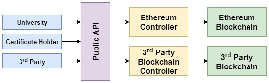
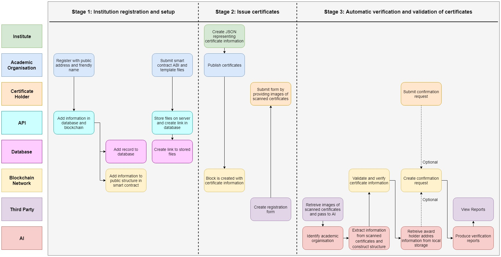

# Old Prototype

## High level concept

## Pipeline of the proposed solution

The typical flow is divided into three main stages:
1. Institution registration and setup
2. Issue of certificates
3. Automatic verification and validation of certificates.
